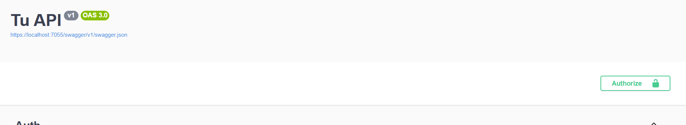

# JWT C#


1. Configuracion servicio de autentificación
Es importante mencionar que esto va en el program, pero si se dan cuenta, no utilizo el builder. Ya que eso hace parte de una extencion del services por medio de la interfaz **IServiceCollection**

>[!IMPORTANT]
> En en achivo appsettings.json lo siguiente:

```
    "JWT": {
        "Key": "78D24960-EA07-4469-96FC-9C5B8692290C"
    }

```

---

 ```

    services.AddAuthentication().AddJwtBearer(opciones =>
    {

        // para evitar que los nombre de los claim los cambie .Net
        opciones.MapInboundClaims = false;

        // parametros para saber cuando es un token valido
        opciones.TokenValidationParameters = new TokenValidationParameters
        {
            ValidateIssuer = false,
            ValidateAudience = false,
            // fecha de vencimiento de esta forma se validara la validez
            ValidateLifetime = true,

            //llave primaria, validacion
            ValidateIssuerSigningKey = true,

            // llave primaria, configuración
            IssuerSigningKey = new SymmetricSecurityKey(Encoding.UTF8.GetBytes(configuracion["JWT:Key"])),

            // para no tener problemas con la hora y fecha de nuestro token
            ClockSkew = TimeSpan.Zero
        };
        }
    );

    return services;
 ```

2. Configurar los dtos, data y negocio del validador de credenciales

- primero crear el dto que vamos a utilizar para recibir las crendenciales:

    ``` 
        // dtio de credenciales
         public class CredencialesDto
            {
                public string Email { get; set; } = string.Empty;
                public string Password { get; set; } = string.Empty;
            }

        // dto para la respuesta
         public class AuthDto
        {
            public string Token { get; set; }
            public DateTime Expiracion { get; set; }
        }

    ```

3. Creacion del utilidad : construccion del token, según la data
Este token solo es generado cuando las credenciales son correctas

>[!IMPORTANT]
>La validacion de credenciales deben ser desarrolada por los encargados de la data, de esa forma se podra utilizar esta funcionalidad de forma correcta

```
using System.IdentityModel.Tokens.Jwt;
using System.Security.Claims;
using System.Text;
using Entity.Dtos.Auth;
using Entity.Model;
using Microsoft.Extensions.Configuration;
using Microsoft.IdentityModel.Tokens;

namespace Utilities.Jwt
{
    public class GenerateTokenJwt
    {
        private IConfiguration _configuration;

        public GenerateTokenJwt(IConfiguration configuration) { 
            _configuration = configuration;
        }

        public async Task<AuthDto> GeneradorToken(User data)
        {

            // configuracion de los claims
            // la idea es solo mandar el id, por cuestiones de seguidad
            var claims = new List<Claim>
            {
                new Claim("id", data.Id.ToString()),
            };


            // firma del token
            var key = new SymmetricSecurityKey(Encoding.UTF8.GetBytes(_configuration["JWT:key"]!));
            
            var creds = new SigningCredentials(key, SecurityAlgorithms.HmacSha256);


            // expiración del token
            var expiracion = DateTime.UtcNow.AddHours(1);

            // Parametros de creacion de token
            var tokenSeguridad = new JwtSecurityToken(issuer: null, audience: null, claims: claims, expires: expiracion, signingCredentials: creds);

            var token = new JwtSecurityTokenHandler().WriteToken(tokenSeguridad);

            // retorna el token, y fecha de expiración
            return new AuthDto
            {
                Token = token,
                Expiracion = expiracion
            };
        } 

        }   
    }

```

# AUTH

1. Creacion de metodo de valiacion de credenciales
Una buena practica es encriptar la contraseña del usuario y guardarla en el campo correpondiente del usuarioh
de esta forma siempre estar en la db el hash de la contraseña

```

    public class AuthData : Auth
    {
        private AplicationDbContext _contenxt;
        private ILogger<AuthData> _logger;
        private readonly GenerateTokenJwt _jwt;

        public AuthData(AplicationDbContext context, ILogger<AuthData> logger, GenerateTokenJwt jwt) 
        {
            _contenxt = context;
            _logger = logger;
            _jwt = jwt;
        }

        public async Task<AuthDto> ValidarLoginAsync(CredencialesDto credenciales) 
        {
            //busqueda del usuario por email, de ese modo se busca en la db
            var user = await _contenxt.Set<User>()
                .FirstOrDefaultAsync(u => u.Email == credenciales.Email);
            

            // validacio
            if (user != null && BCrypt.Net.BCrypt.Verify(credenciales.Password, user.Password))
            {
                var token = await _jwt.GeneradorToken(user);
                return token;
            }

            return null;
        }


    }

```

>[!IMPORTANT]
> Este es un metodo de comprobacion de credenciales a la base de datos, utilizando el utitiles de jwt generador de token, cuando las credenciales sean correctas


## Implementacion de este servicio
Con esto creado ya solo queda exponerlo en un controlador y proteger las rutas como el siguiente ejemplo: 

```

     [Route("api/[controller]")]
    [ApiController]
    [Authorize] // CON ESTO ASEGURAMOS LA RUTA
    [Produces("application/json")]
    public class UserController : ControllerBase
    {
        private readonly UserBusiness _UserBusiness;
        private readonly ILogger<UserController> _logger;

        /// Constructor del controlador de permisos
        public UserController(UserBusiness UserBusiness, ILogger<UserController> logger)
        {
            _UserBusiness = UserBusiness;
            _logger = logger;
        }
    }
```

>[!WARNING]
> Por logica de negocio, se deja publico el logeo


> [!TIP]
> Para poder ver esto en swagger se tiene que configurar la interfaz


> Aqui se configura con el extends de programa para dejar limpio el program
```
     public static IServiceCollection AddViewAuthApi(this IServiceCollection services)
    {
        services.AddSwaggerGen(c =>
        {
            c.SwaggerDoc("v1", new OpenApiInfo { Title = "Tu API", Version = "v1" });

            var jwtSecurityScheme = new OpenApiSecurityScheme
            {
                Scheme = "bearer",
                BearerFormat = "JWT",
                Name = "Authorization",
                In = ParameterLocation.Header,
                Type = SecuritySchemeType.Http,
                Description = "Ingresa el token JWT como: Bearer {tu token}",

                Reference = new OpenApiReference
                {
                    Id = JwtBearerDefaults.AuthenticationScheme,
                    Type = ReferenceType.SecurityScheme
                }
            };

            c.AddSecurityDefinition(jwtSecurityScheme.Reference.Id, jwtSecurityScheme);

            c.AddSecurityRequirement(new OpenApiSecurityRequirement
            {
                { jwtSecurityScheme, Array.Empty<string>() }
            });
        });

        return services;

    }

```

### esto es el resultado de esta ultima configuración




# OAUTH
##  Requisitos Previos

- Visual Studio 2019/2022
- SDK .NET Core 3.1+ o .NET 5/6
- Cuenta de Google Cloud Platform
- Paquetes NuGet:
  - `Microsoft.AspNetCore.Authentication.Google`
  - `Google.Apis.Auth` (para validar el ID Token)

---

## 🔧 Paso 1: Configuración en Google Cloud Platform

1. **Accede a Google Cloud Console**:

   - 🌐 [Google Cloud Console](https://console.cloud.google.com/)
   - Crea o selecciona un proyecto existente

2. **Configura la pantalla de consentimiento OAuth**:

   - Ir a **APIs y Servicios** > **Pantalla de consentimiento OAuth**
   - Tipo: `Externo` (para desarrollo) o `Interno` (GSuite)
   - Llena los campos requeridos: Nombre, Email de soporte, URLs de privacidad y términos (puedes usar placeholders)

3. **Crea credenciales OAuth 2.0**:
   - Ir a **Credenciales** > **Crear credenciales** > **ID de cliente OAuth**
   - Tipo de aplicación: `Aplicación web`
   - URIs autorizados:
     - `https://localhost:[PORT]/signin-google` para desarrollo
     - Agrega las URLs de producción si aplica
   - Guarda el **Client ID** y **Client Secret**

---

2. **Agrega configuración en `appsettings.json`**:

   ```json
   {
     "Authentication": {
       "Google": {
         "ClientId": "TU_CLIENT_ID.apps.googleusercontent.com",
         "ClientSecret": "TU_CLIENT_SECRET",
         "Audience": "TU_CLIENT_ID.apps.googleusercontent.com"
       }
     }
   }
   ```

3. **Configura `Program.cs`**:

   ```csharp
   using Microsoft.AspNetCore.Authentication.Cookies;
   using Microsoft.AspNetCore.Authentication.Google;

   var builder = WebApplication.CreateBuilder(args);

   builder.Services.AddAuthentication(options =>
   {
       options.DefaultScheme = CookieAuthenticationDefaults.AuthenticationScheme;
       options.DefaultChallengeScheme = GoogleDefaults.AuthenticationScheme;
   })
   .AddGoogle(options =>
   {
       options.ClientId = builder.Configuration["Authentication:Google:ClientId"];
       options.ClientSecret = builder.Configuration["Authentication:Google:ClientSecret"];
       options.CallbackPath = "/signin-google";
   });

   builder.Services.AddControllers();

   var app = builder.Build();

   app.UseAuthentication();
   app.UseAuthorization();
   app.MapControllers();

   app.Run();
   ```

---

## 🌐 Paso 3: Flujo de Autenticación con Google

1. El frontend solicita iniciar sesión con Google usando la API de Google.
2. Google responde con un `ID Token` (JWT).
3. El frontend envía el `tokenId` al backend.
4. El backend valida el token y genera su propio JWT.


##  Validación del Token de Google

```csharp
public class TokenService : ITokenService
{
    private readonly IConfiguration _config;

    public TokenService(IConfiguration config)
    {
        _config = config;
    }


    public async Task<GoogleJsonWebSignature.Payload?> VerifyGoogleToken(string tokenId)
    {
        try
        {
            var settings = new GoogleJsonWebSignature.ValidationSettings
            {
                Audience = new List<string> { _config["Authentication:Google:Audience"] }
            };

            var payload = await GoogleJsonWebSignature.ValidateAsync(tokenId, settings);
            return payload;
        }
        catch
        {
            return null;
        }
    }

    public async Task<string> GenerateToken(LoginData data)
    {
        // Aquí generas el JWT propio de tu sistema con Claims, etc.
        return "jwt_generado";
    }
}
```


## DTOs de Apoyo

```csharp
public class GoogleTokenDto
{
    public string TokenId { get; set; } = string.Empty;
}

public class LoginData
{
    public string Email { get; set; }
    public int UserId { get; set; }
}
```

---